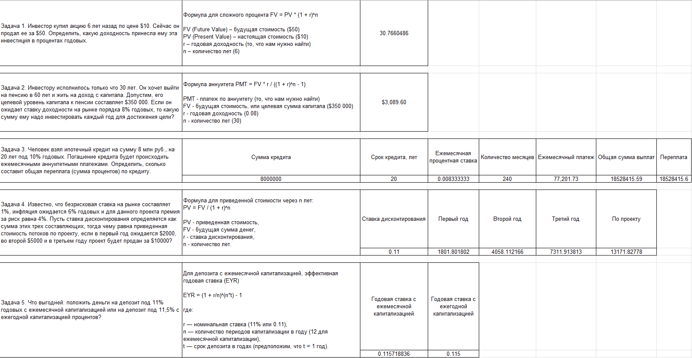
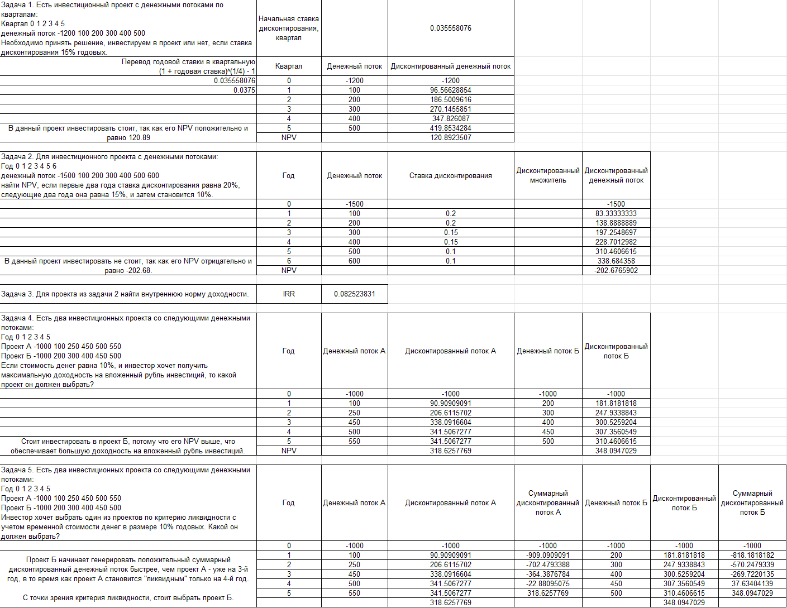

# Финансовая математика

---

## Урок 1. Временная стоимость денег. Процентные расчеты

[lesson1.xlsx](lesson1.xlsx)

## Урок 2. Оценка эффективности инвестиций

[lesson2.xlsx](lesson2.xlsx)

## Урок 3. Применение статистики в экономике и финансах. Введение в эконометрику

[lesson3.ipynb](lesson3.ipynb)
